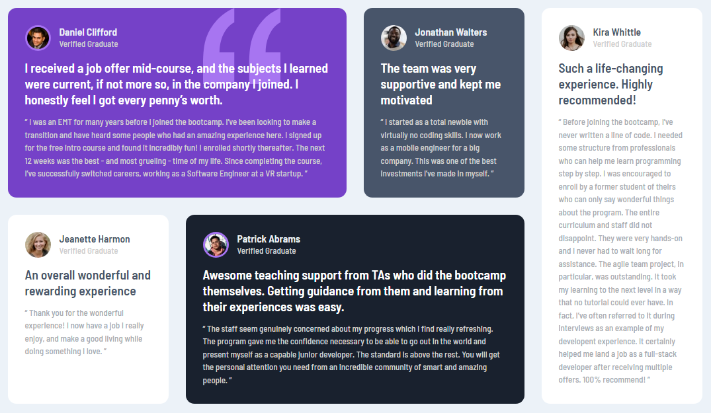

# Frontend Mentor - Testimonials grid section solution

This is a solution to the [Testimonials grid section challenge on Frontend Mentor](https://www.frontendmentor.io/challenges/testimonials-grid-section-Nnw6J7Un7). Frontend Mentor challenges help you improve your coding skills by building realistic projects.

## Table of contents

- [Overview](#overview)
  - [The challenge](#the-challenge)
  - [Screenshot](#screenshot)
  - [Links](#links)
- [My process](#my-process)
  - [Built with](#built-with)
  - [What I learned](#what-i-learned)
  - [Useful resources](#useful-resources)
- [Author](#author)

## Overview

### The challenge

Users should be able to:

- View the optimal layout for the site depending on their device's screen size

### Screenshot

### Links

- Github URL: [Github URL](https://github.com/exchyphen/fm_testimonials-grid-section)
- Live Site URL: [live site hosted by Github Pages](https://exchyphen.github.io/fm_testimonials-grid-section/)

## My process

### Built with

- HTML
- CSS

### What I learned

CSS grid basics, how to position, and general layout practice.

### Useful resources

- [CSS Tricks - Grid](https://css-tricks.com/snippets/css/complete-guide-grid/) - Great cheatsheet on CSS grids.

## Author

- Github - [exchyphen](https://github.com/exchyphen)
- Frontend Mentor - [@exchyphen](https://www.frontendmentor.io/profile/exchyphen)
